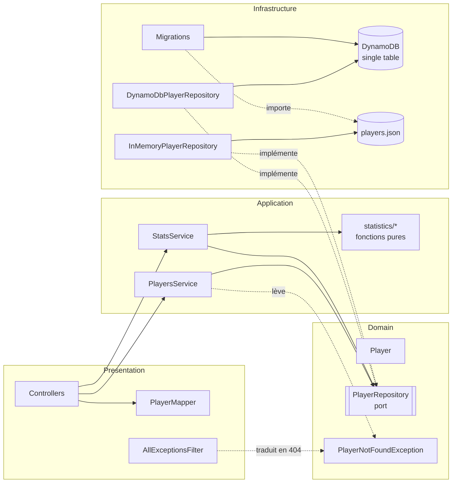

# Architecture et choix techniques

[← README](../README.md)

## Architecture

### Découpage

Le code suit une architecture hexagonale « légère » : le domaine et les cas d'usage ne dépendent ni de Nest ni d'AWS. Seules les couches périphériques connaissent le framework.

```
src/
├── players/
│   ├── domain/            # Entité Player (unités explicites), port PlayerRepository + token, exceptions métier
│   ├── application/       # PlayersService, StatsService : TypeScript pur, sans décorateur Nest
│   │   └── statistics/    # Fonctions pures : median, mean, round, bodyMassIndex, bestCountryByWinRatio
│   ├── infrastructure/    # Adapters du port PlayerRepository et choix de l'implémentation
│   │   ├── dynamodb/      # DynamoDbPlayerRepository, mapping entité ↔ item (clés single-table)
│   │   ├── data/          # players.json (jeu de données du client)
│   │   └── …              # InMemoryPlayerRepository, mapping du JSON brut (g → kg), factory
│   ├── presentation/      # Controllers, DTOs (validation + Swagger), mapper domaine ↔ HTTP
│   ├── testing/           # Fixtures et doubles de test (exclus du build)
│   └── players.module.ts  # Composition root : câblage explicite par factories
├── database/              # Infrastructure DynamoDB partagée
│   ├── table-schema.ts    # Contrat single-table (clés, GSI), partagé avec la stack CDK
│   ├── migrations/        # Migrations versionnées + MigrationRunner
│   ├── migrate.handler.ts # Lambda de la custom resource de migration
│   └── migrate.cli.ts     # npm run db:migrate
├── config/                # Configuration lue depuis l'environnement
├── health/                # Healthcheck
├── common/
│   ├── domain/            # DomainException, EntityNotFoundException (agnostiques du transport)
│   ├── filters/           # AllExceptionsFilter : exceptions → format d'erreur uniforme
│   └── pipes/             # ParsePositiveIntPipe
├── app.setup.ts           # Config HTTP partagée : préfixe, ValidationPipe, filtre, Swagger
├── main.ts                # Bootstrap local
└── lambda.ts              # Handler Lambda (instance Nest mise en cache entre invocations)
infra/
├── bin/app.ts             # App CDK
├── lib/                   # TennisPlayersStack
├── lambda/index.mjs       # Point d'entrée ESM du bundle Lambda
└── test/                  # Assertions et snapshot CDK
test/                      # Tests e2e et tests d'intégration DynamoDB Local (test/integration)
compose.yaml               # DynamoDB Local
```



### Principes appliqués

- **Pas de logique métier dans les controllers.** Ils valident l'entrée (DTO et pipes), délèguent au service, puis mappent le résultat vers un DTO de réponse.
- **Services applicatifs indépendants du framework.** `PlayersService` et `StatsService` sont de simples classes. `PlayersModule` les instancie via `useFactory`, en injectant le port `PLAYER_REPOSITORY`. On peut les tester sans `TestingModule`, et ils sont réutilisables hors de Nest.
- **Calculs dans des fonctions pures.** Médiane, IMC, ratio et arrondi sont testés isolément, sans mock.
- **Exceptions métier dédiées.** `PlayerNotFoundException` hérite de `EntityNotFoundException` et ne connaît pas HTTP. Seul `AllExceptionsFilter` fait la traduction en statut HTTP.
- **Unités explicites.** Le poids brut en grammes est converti **une seule fois**, à la frontière d'infrastructure. Le domaine et l'API ne manipulent que `weightKg` et `heightCm`.
- **Fail fast au chargement.** Un sexe ou un résultat de match invalide dans le JSON lève une erreur au démarrage, plutôt que de servir des statistiques fausses.
- **Implémentation du repository choisie par configuration.** Si `PLAYERS_TABLE_NAME` est défini (toujours le cas sur Lambda), le repository DynamoDB est utilisé. Sinon, c'est le repository en mémoire, pour le développement local sans AWS et pour des tests e2e rapides. Les deux sont interchangeables derrière le port, et les tests d'intégration vérifient qu'ils produisent les mêmes résultats.
- **Écritures protégées, échec fermé.** `POST /players` exige le header `x-api-key`, vérifié par `ApiKeyGuard` avant toute validation du corps. Sans clé configurée, toutes les écritures sont refusées.
- **Configuration HTTP unique.** `configureApp()` est partagée par `main.ts`, `lambda.ts` et les tests e2e, qui se comportent donc à l'identique.

## Choix techniques

### NestJS

NestJS impose une structure (modules, injection de dépendances, pipes, filtres) qui rend un code d'équipe homogène et facile à reprendre, ce qui compte pour un livrable client. Il fournit aussi en standard la validation déclarative (`class-validator`) et la génération OpenAPI (`@nestjs/swagger`). La contrepartie est un cold start plus lourd qu'un handler « nu ». Ici il reste modéré : environ 60 ms d'initialisation Nest mesurés en local sur le bundle.

**Version : NestJS 12**, la version stable courante. Elle est publiée **en ESM uniquement**, ce qui a deux conséquences :

- L'application reste en CommonJS, comme le template officiel `nest new`. Node 24 charge les paquets ESM de Nest via `require(esm)`.
- Jest 30 a besoin de `--experimental-vm-modules` pour cette même fonctionnalité. Les scripts `test*` passent ce flag.

### AWS Lambda + API Gateway HTTP API

- **Lambda** : pas de serveur à gérer, facturation à l'usage, montée en charge automatique. C'est le bon modèle pour une API à trafic faible ou irrégulier, principalement en lecture.
- **HTTP API** plutôt que REST API : environ 70 % moins cher, avec moins de latence et le payload v2. Les fonctionnalités propres aux REST API (clés d'API, usage plans, transformations VTL) ne sont pas nécessaires ici.
- **Lambda monolithique** (« Lambdalith ») avec une route `$default` : tout le routage, la validation et les 404 restent dans Nest. On garde ainsi une seule source de vérité, et l'application tourne aussi en local et dans Docker.
- **`@codegenie/serverless-express` v5** (le successeur maintenu de `@vendia/serverless-express`) traduit les événements API Gateway en requêtes Express. L'instance Nest est **mise en cache au niveau du module** : seul le cold start paie le bootstrap. Un bootstrap en échec n'est pas mis en cache, l'invocation suivante réessaie.
- **Node.js 24 sur ARM64 (Graviton)** : c'est le runtime LTS courant, requis par serverless-express v5, et l'ARM coûte environ 20 % de moins que x86.

### DynamoDB plutôt que RDS (MySQL)

| Critère                | DynamoDB (on-demand)                              | RDS MySQL                                                                             |
| ---------------------- | ------------------------------------------------- | ------------------------------------------------------------------------------------- |
| Coût au repos          | **0 €** : facturation à la requête et au stockage | ~15 $/mois minimum (`db.t4g.micro`), gratuit 12 mois seulement sur un compte neuf     |
| Intégration Lambda     | API HTTP, pas de connexion à gérer, IAM natif     | Lambda dans un VPC, VPC endpoints ou NAT payant, RDS Proxy pour le pool de connexions |
| Exploitation           | Serverless : ni patch, ni dimensionnement         | Instance à dimensionner, fenêtres de maintenance                                      |
| Adéquation aux données | Peu d'access patterns, tous connus : idéal        | Utile pour des requêtes ad hoc et des jointures, inutiles ici                         |

Pour un jeu de données principalement lu, avec des access patterns connus et un trafic sporadique, DynamoDB est à la fois moins cher et plus simple à opérer.

### AWS CDK plutôt que Serverless Framework

| Critère        | AWS CDK                                                         | Serverless Framework                                         |
| -------------- | --------------------------------------------------------------- | ------------------------------------------------------------ |
| Langage        | TypeScript, comme l'application : typage, autocomplétion, tests | YAML et plugins                                              |
| Couverture     | Tous les services AWS, constructs L2 haut niveau                | Centré sur Lambda, le reste passe par du CloudFormation brut |
| Testabilité    | `aws-cdk-lib/assertions` (voir `infra/test`)                    | Limitée                                                      |
| Licence / coût | Open source (Apache 2.0), porté par AWS                         | v4 payante au-delà d'un certain chiffre d'affaires           |
| Écosystème     | Constructs réutilisables et partageables                        | Plugins communautaires de qualité variable                   |

CDK permet de traiter l'infrastructure comme du code applicatif : relu, typé et testé dans la même CI.

### Bundling de la Lambda

esbuild ne sait pas émettre les métadonnées de décorateurs (`emitDecoratorMetadata`). Or Nest en a besoin pour l'injection de dépendances, le `ValidationPipe` et Swagger. La chaîne de build est donc :

1. `nest build` : `tsc` compile `src/` vers `dist/` en émettant les métadonnées.
2. `NodejsFunction` (esbuild) bundle `dist/lambda.js` via `infra/lambda/index.mjs` en **un seul fichier ESM**, minifié et accompagné de sa sourcemap. C'est nécessaire parce que les paquets de Nest 12 utilisent `import.meta.url`.
3. `swagger-ui-dist` est copié à côté du bundle : Swagger UI sert ses assets statiques depuis son propre répertoire. Les sourcemaps et les variantes ES de Swagger UI en sont retirées, ce qui allège l'asset d'environ 9 Mo.

Les modules optionnels de Nest (`@nestjs/microservices`, `@nestjs/websockets`, `@fastify/static`) sont déclarés externes : ils sont importés dynamiquement par Nest mais inutilisés ici.

Le **SDK AWS est bundlé** dans les deux fonctions plutôt que pris dans le runtime Lambda : sa version est ainsi figée par le `package-lock.json`, comme le recommande AWS. La Lambda de migration, qui n'a pas de décorateurs, est bundlée directement depuis ses sources TypeScript.

Les deux bundles produits par `cdk synth` ont été exécutés hors du projet contre DynamoDB Local : migration, puis requêtes sur l'API.

## Persistance : DynamoDB single-table

### Modèle

Une seule table, avec des clés génériques et surchargées (`PK`, `SK`, `GSI1PK`…). Leur sens dépend de l'entité (`entityType`). Le contrat est défini une seule fois, dans `src/database/table-schema.ts`, et partagé par l'application, les migrations, les tests d'intégration et la stack CDK.

| Entité    | PK            | SK                              | GSI1PK    | GSI1SK         | GSI2PK         | GSI2SK         |
| --------- | ------------- | ------------------------------- | --------- | -------------- | -------------- | -------------- |
| Player    | `PLAYER#<id>` | `PROFILE`                       | `PLAYERS` | `RANK#<00001>` | `COUNTRY#<cc>` | `RANK#<00001>` |
| Migration | `MIGRATIONS`  | `<id>` (ex. `001-seed-players`) |           |                |                |                |
| Counter   | `COUNTER`     | `PLAYER`                        |           |                |                |                |

Le rang est complété par des zéros (`RANK#00002`) : l'ordre lexicographique des clés de tri est ainsi l'ordre numérique. La SK `PROFILE` laisse la place à d'autres items dans la partition d'un joueur (par exemple `MATCH#<date>` pour un historique de matchs).

### Access patterns

| Besoin                     | Opération                                                                                          |
| -------------------------- | -------------------------------------------------------------------------------------------------- |
| `GET /players/:id`         | `GetItem` `PK = PLAYER#<id>`, `SK = PROFILE`                                                       |
| `GET /players` et `/stats` | `Query` GSI1 `GSI1PK = PLAYERS` (déjà trié par rang)                                               |
| `GET /players?country=SRB` | `Query` GSI2 `GSI2PK = COUNTRY#SRB` (trié par rang)                                                |
| `?sex=F`                   | `FilterExpression` sur la requête précédente : deux valeurs seulement, un index ne se justifie pas |
| `POST /players`            | `UpdateItem ADD` sur le compteur (nouvel id), puis `PutItem` conditionnel (`attribute_not_exists`) |
| Migrations déjà appliquées | `Query` `PK = MIGRATIONS`                                                                          |

**Aucun `Scan`** : le coût d'une requête ne dépend pas des autres entités de la table. Les résultats sont paginés de bout en bout (`LastEvaluatedKey`). Le tri par rang reste aussi garanti par `PlayersService`, qui ne dépend pas d'un détail d'implémentation du repository.

**Génération des ids** : un compteur atomique (`UpdateItem ADD`) fournit les ids des nouveaux joueurs. Ils restent uniques même avec des créations simultanées (vérifié en intégration avec 20 créations concurrentes). L'écriture du joueur est conditionnelle : elle ne peut jamais écraser un joueur existant.

**Cohérence** : les index secondaires sont mis à jour de façon asynchrone. Juste après un `POST`, la liste peut donc ne pas contenir le joueur pendant quelques millisecondes. `GET /players/:id` utilise une lecture fortement cohérente : la ressource est toujours lisible à l'URL renvoyée dans `Location`.

### Migrations

Les migrations sont versionnées dans `src/database/migrations/`, exécutées dans l'ordre et une seule fois par table. Chaque migration appliquée est enregistrée **dans la table elle-même**, comme une entité à part (`PK = MIGRATIONS`).

- **Au déploiement**, une custom resource CloudFormation (`Custom::DatabaseMigrations`) appelle une Lambda dédiée, qui applique les migrations en attente. Ses propriétés listent les ids des migrations : en ajouter une déclenche une mise à jour de la ressource, donc une nouvelle exécution. La Lambda de l'API dépend de cette ressource, si bien que le nouveau code n'est déployé qu'une fois les données migrées.
- **En local**, `npm run db:migrate` exécute le même runner.
- **Règles** :
  - une migration est idempotente (une migration interrompue est rejouée en entier) ;
  - une migration appliquée n'est jamais modifiée : on en écrit une nouvelle ;
  - l'id suit le format `NNN-kebab-case`, vérifié au démarrage du runner.
- **`001-seed-players`** importe `players.json` avec le même mapper que le repository en mémoire : la conversion grammes → kg et la validation restent à un seul endroit. Les écritures passent par `BatchWriteItem`, par lots de 25, avec reprise des items non traités et backoff exponentiel.
- **`002-init-player-id-counter`** initialise le compteur d'ids au plus grand id existant (102), pour que les joueurs créés via l'API ne réutilisent jamais un id importé. Le compteur ne peut qu'avancer : rejouer la migration est sans effet.

Les droits suivent le principe du moindre privilège :

- la Lambda de migration lit et écrit dans la table ;
- la Lambda de l'API peut lire, et n'a que `PutItem` / `UpdateItem`, limités par une condition IAM `dynamodb:LeadingKeys` aux partitions `PLAYER#*` et `COUNTER`. Elle ne peut ni supprimer, ni toucher aux items de migration.
